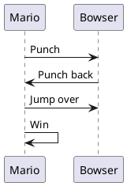
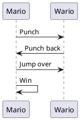
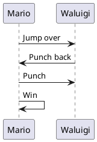

# DRYer

DRYer (Do not Repeat Yourself) aims to be a **minimilastic**, **non-intrusive**, (yet powerfull) **substitution** language.

- **minimalistic**: very simple syntax
- **non-intrusive**: To make DRYer work on most filetype, we take the approach to make the DRY statements live exclusively in the comments of the original file find below an example in YAML and html. This enables the developper to visualize/compile or run a valid template file and then generate the derived versions.

```python
"""
[[FILES = ./mario.py ./luigi.py ./peach.py;]]
I can still write comments here
"""
# Also write code here
TEMPERATURE = 25

# [[match FILES
def greet_from_mario():
    return "It is me Mario!"

if __name__ == '__main__':
    print(greet_from_mario())

# |> ./luigi.py: mario -> luigi; Mario -> Luigi
# |> ./peach.py: mario -> peach; Mario -> Peach;]]
```

```yaml
# [[
# FILES = ./mario.yaml ./luigi.yaml ./peach.yaml ./wario.yaml;
# ]]
meta: waluigi
# [[ match FILES
character: mario
color: red
# |> ./luigi.yaml: red -> green; mario -> luigi;
# |> ./peach.yaml: color: red -> color: pink; mario -> peach;
# |> ./wario.yaml: red -> yellow; mario -> wario;
# ]]
```

- **substitution language**: a bit in the same way as latex the goal is to substitute and not to have complexe logic and arithmetic

## Requiremnents

- [GNU/Linux](https://www.gnu.org/gnu/linux-and-gnu.html) operating system
- [cargo](https://doc.rust-lang.org/stable/cargo/)

## Usage

> Most of the functionalities presented in this README are yet to be implemented

- Install the binary (very experimental)
```bash
cargo install
```
- Run the tests of the project
```bash
cargo test
```
- Run the program
```bash
cargo run
```

## Motivation through a use case

Let's consider that Mario try to explain his strategy to attack the vilain of his universe. He makes a schematic to explain his plan to Luigi and Toad using PlantUML in a file named `./bowser.puml`



His friends are impressed and want to make presentations to the inhabitants of the mushroom kingdom of Mario's strategy.
However the threats are different based on the neighbourhood you live in; some inhabitants are more afraid of Waluigi or Wario than bowser, and in the case of Waluigi the strategy differ as you first need to jump over of him and then punch him.

Mario want to have different version of the document but without repeating him as he is aware of the DRY principle (Do not Repeat Yourself).
He accidently arrives on this repository of code and realize that it is exactly after a slight reformatting of his code he has the following `template.puml`:


This generate the following files:
- `./bowser.puml`

- `./wario.puml`

- `./waluigi.puml`


Mario his happy as he can efficiently communicate with the inhabitants of the mushroom kingdom, while following the DRY principle.

## Roadmap 

- Implement what is in this README page
- Document

## Contributing

At this point the project is really young and I take any advice both in terms of ergonomy and implementation

### Current contributor(s)

- [RobinCamarasa](https://robincamarasa.github.io)
